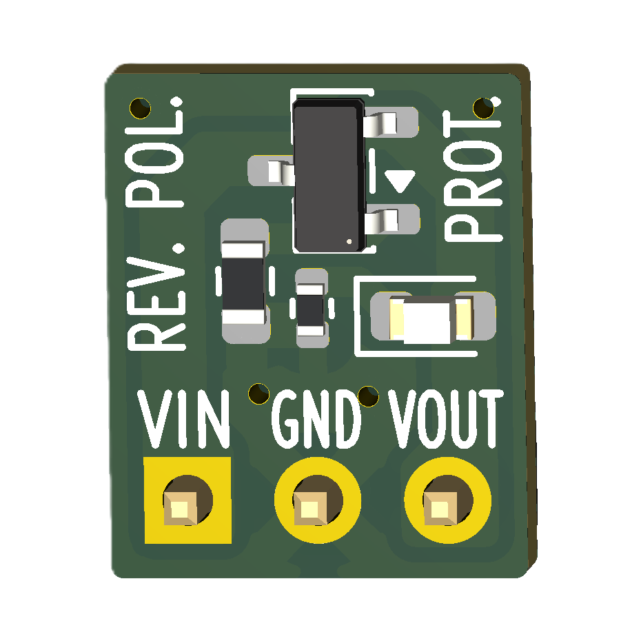
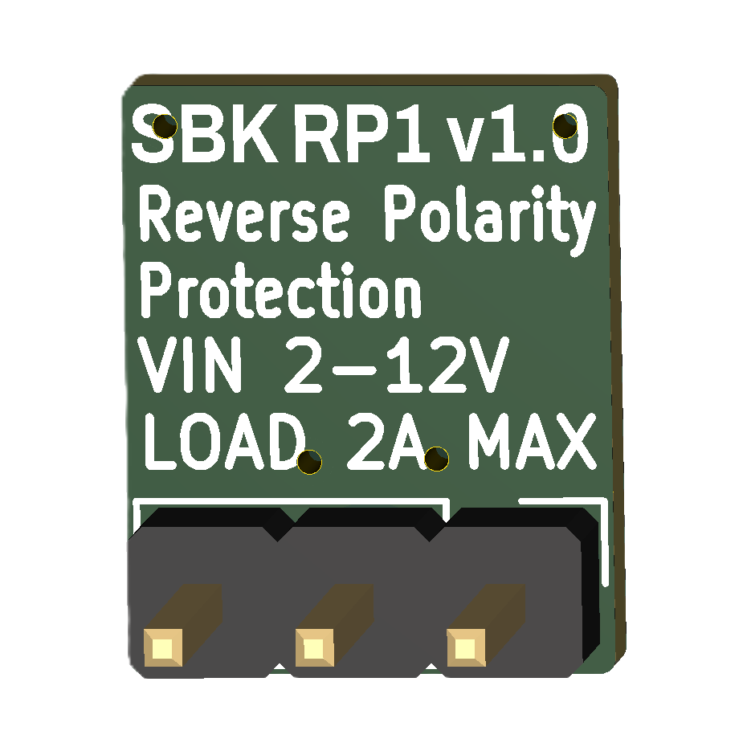

# SBK_RP1

<p align="center">
  
  &nbsp;&nbsp;&nbsp;
  
</p>

<p align="center">
  <b>Front</b> &nbsp;&nbsp;&nbsp;&nbsp;&nbsp;&nbsp;&nbsp;&nbsp;&nbsp;&nbsp;&nbsp;&nbsp;&nbsp;&nbsp;&nbsp;&nbsp;&nbsp;&nbsp;&nbsp;&nbsp;&nbsp;&nbsp;&nbsp;&nbsp;&nbsp;&nbsp;&nbsp;
  <b>Back</b>
</p>

---

## Open-source reverse polarity protection module for learning and embedded electronics projects.

SBK_RP1 is a compact, reusable hardware module that protects low-voltage DC electronic circuits against accidental reverse battery connections. Using a P-channel MOSFET ideal-diode topology, it provides reverse polarity protection with a much lower voltage drop than a conventional series diode. An integrated LED indicates when protected output power is available.

Designed for breadboards, prototypes, and educational projects, SBK_RP1 offers a simple way to improve the robustness and reliability of battery-powered embedded systems.

---

## Features

- Input voltage: **2–12 VDC**
- Maximum Load current: **2 A**
- Maximum practical current depends on operating voltage, ambient temperature, PCB cooling, and allowable temperature rise.
- Reverse polarity protection using a **P-channel MOSFET**
- Very low forward voltage drop
- Protected output power status LED
- Breadboard-friendly 2.54 mm pin header
- Optimized for low-cost assembly using JLCPCB Basic components

---

## Pinout

| Pin | Description |
|------|-------------|
| **VIN** | Power input (2–12 VDC) |
| **GND** | Ground |
| **VOUT** | Protected power output |

---

## Typical Application

```text
Battery
   │
SBK_RP1
   │
SBK_SP1 (optional)
   │
Embedded System
```

SBK_RP1 is installed between the power source and the electronic circuit. During normal operation it introduces only a very small voltage drop. If the supply is accidentally connected in reverse, the module automatically blocks current, protecting the downstream electronics.

---

## Operation

1. Connect the power source to **VIN** and **GND**.
2. With correct polarity, the MOSFET turns on and powers **VOUT**.
3. The voltage drop across the module remains very low.
4. If the supply polarity is reversed, the MOSFET blocks sustained current flow to the protected output.
5. Current flow is blocked, protecting the connected circuit.
6. The output status LED indicates when protected power is present at **VOUT**.

---

## Applications

### Microcontroller platforms

- Arduino
- ESP32
- RP2040
- ATtiny
- STM32

### Example applications

- Battery-powered embedded systems
- Portable instruments
- Sensors
- Educational electronics projects
- Custom electronic devices

---

## Notes

- Designed for low-voltage DC electronic circuits.
- Protects against accidental reverse polarity connections.
- Does not provide over-current or over-voltage protection.
- The output status LED indicates the presence of protected output voltage; it is not a reverse polarity indicator.

---

## Getting Started

This project is fully open-source hardware. You can:

- Build your own module using the provided KiCad design files.
- Modify the design to suit your application.
- Manufacture your own boards.

### Assembled Modules

If you would prefer fully assembled modules rather than assembling the PCBs yourself, I can provide professionally assembled modules in small batches on demand.

For availability, pricing, or custom quantities, please contact:

📧 **SmartBuildsKits@gmail.com**

Assembled modules are intended for hobbyists, educators, prototypes, and small-scale projects. Availability depends on component stock and production capacity.

---

## Related Projects

- [**SBK_SP1**](https://github.com/sbarabe/SBK_SP1) – Soft Power Switch Module
- [**MémoBot**](https://github.com/sbarabe/MemoBot) – Educational memory game built using SBK_SP1 and SBK_RP1

---

## License

This project is released as open-source hardware under the **CERN Open Hardware Licence Version 2 - Permissive (CERN-OHL-P v2)**.

You are free to study, modify, manufacture, and distribute this design, provided the terms of the license are respected.

See the [LICENSE](LICENSE) file for the full license text.

---

## Design Files

This project was designed using **KiCad 10**.

- [KiCad hardware files](hardware/)
- [Bill of materials](hardware/bom.csv)
- [SBK_RP1 datasheet](docs/SBK_RP1_datasheet.pdf)
